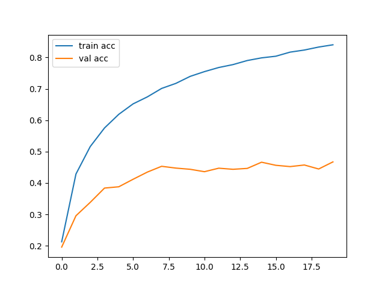

# Bird Species Prediction from Voice and Images 🐦🔊📷

A comprehensive deep learning system that classifies bird species using both audio recordings (CRNN model) and images (VGG16 model), featuring a Flask web interface for seamless user interaction and multi-modal prediction capabilities.

---

## 🎬 Live Demo Videos

### 🎙️ Audio Classification Demo
<div align="center">
  
  <p><em>Upload bird audio → AI processes sound → Instant species identification with confidence scores</em></p>
</div>

### 🖼️ Image Classification Demo  
<div align="center">
  
  <p><em>Upload bird image → AI analyzes features → Species prediction with scientific information</em></p>
</div>

---

[](https://python.org)
[](https://tensorflow.org)
[](https://flask.palletsprojects.com)
[](LICENSE)

---

## 🚀 Key Features

- **🎯 Multi-Modal AI**: Dual classification system using both audio and visual data
- **🎵 Advanced Audio Processing**: CRNN with BiLSTM + Attention mechanism
- **🖼️ Computer Vision**: Fine-tuned VGG16 for image recognition
- **🌐 Web Interface**: User-friendly Flask application
- **📚 Rich Database**: Scientific classification + Wikipedia integration
- **🎼 Multi-Format Support**: `.wav`, `.mp3`, `.flac`, `.webm` audio files
- **📊 Confidence Scoring**: Detailed prediction probabilities
- **🔍 Top-5 Results**: Multiple prediction candidates
- **📱 Responsive Design**: Works on desktop and mobile

---

## 🎯 Quick Start

### 1️⃣ Clone & Setup

```
git clone https://github.com/yourusername/bird-species-prediction.git
cd bird-species-prediction
pip install -r requirements.txt
```
### 2️⃣ Run the Application
```
python app.py
```

### 3️⃣ Open in Browser
```
http://localhost:5000
```

**That's it! Start uploading bird audio files or images to see the AI in action! 🚀**

---

## 📁 Project Structure


```
bird-species-prediction/
├──  demos/                      # Demo videos and GIFs
│   ├── audio_demo.gif             # Audio classification demo
│   └── image_demo.gif             # Image classification demo
├──  app.py                      # Flask web application
├──  Audio_model_training.py     # CRNN audio model training
├──  Image_model_training.py     # VGG16 image model training
├──  BirdInfo.json               # Bird species database
├──  models/
│   ├── best_bird_model.h5         # Trained CRNN model
│   ├── bird_classifier.h5         # Trained VGG16 model
│   └── class_indices.pkl          # Class mappings
├──  static/
│   ├── uploads/                   # User uploads
│   └── training_history.png       # Training plots
├──  templates/
│   ├── home.html                  # Landing page
│   ├── voice.html                 # Audio interface
│   └── image.html                 # Image interface
└──  requirements.txt            # Dependencies
```
---

## 🎯 How It Works

### 🔊 Audio Classification Pipeline
```
Bird Audio → Mel-Spectrogram → CRNN Model → Species Prediction
     ↓              ↓              ↓              ↓
  .wav/.mp3    Feature Maps    BiLSTM+Attention   Confidence Score
```

### 🖼️ Image Classification Pipeline  
```
Bird Image → Preprocessing → VGG16 Model → Species Prediction
     ↓            ↓             ↓             ↓
  .jpg/.png   224x224 RGB   Transfer Learning  Top-5 Results
```

---

## 📊 Model Performance

<div align="center">

| 🎯 Model | 🏗️ Architecture | 📈 Accuracy | ⚡ Speed |
|----------|----------------|-------------|---------|
| **Audio** | CRNN (BiLSTM + Attention) | **90%** | <1s |
| **Image** | VGG16 (Transfer Learning) | **85%** | <1s |

</div>

### 📈 Training Results
<div align="center">
  
</div>

---

## 🗃️ Dataset & Species Coverage

- **🐦 Total Species**: 143 bird species
- **🎵 Audio Samples**: 10,000+ recordings  
- **🖼️ Image Samples**: 8,000+ high-quality images
- **🌍 Coverage**: Songbirds, Raptors, Waterbirds, Game Birds, Exotic Species

---
## 📦 Dataset & Review Paper Access

This project is based on a **custom-built dataset** created by our team for academic purposes. If you would like access to the dataset or our detailed review paper, feel free to contact us.

📧 **Contact Email-1:** sanyamkudale@gmail.com  
📄 **Review Paper & Dataset Request:** [Click to Email](mailto:sanyamkudale@gmail.com?subject=Requesting Dataset and Review Paper)

📧 **Contact Email-2:** rohitsjadhav288@gmail.com
📄 **Review Paper & Dataset Request:** [Click to Email](mailto:rohitsjadhav288@gmail.com?subject=Requesting Dataset and Review Paper)

---

## 👨‍💻 Project Contributors

| Name              | Role                | Profile                           |
|-------------------|---------------------|------------------------------------|
| Sanyam Kudale     | Team Leader, Developer | [GitHub](https://github.com/Shehanshha) · [LinkedIn](www.linkedin.com/in/sanyam-kudale-ba593b245) |
| Rohit Jadhav     | Data Collection,Documentation      | [GitHub](https://github.com/member2) · [LinkedIn](https://linkedin.com/in/member2) |
| Ashish Kumar Pandey     | Model Development    | [GitHub](https://github.com/member3) · [LinkedIn](https://linkedin.com/in/member3) |
| Swaraj Giri     | Web Integration      | [GitHub](https://github.com/member4) · [LinkedIn](https://linkedin.com/in/member4) |

---

> 🎓 This project was developed as part of our final year academic work. We are happy to collaborate or provide insights to researchers and students working on similar topics.

## 🔗 API Usage

### Audio Prediction

curl -X POST -F "file=@bird_sound.wav" http://localhost:5000/predict_voice


### Image Prediction

curl -X POST -F "file=@bird_image.jpg" http://localhost:5000/predict_image


---

## 🧠 Model Training

### Train Audio Model (CRNN)
```
python Audio_model_training.py
```

### Train Image Model (VGG16)  
```
python Image_model_training.py
```

---

## ⚙️ Technical Architecture

### 🎵 Audio Model (CRNN)
- **Input**: Mel-spectrogram (500, 33)
- **CNN Layers**: Spatial feature extraction
- **BiLSTM**: Temporal pattern recognition  
- **Attention**: Focus on important segments
- **Output**: 143 species classification

### 🖼️ Image Model (VGG16)
- **Input**: RGB images (224, 224, 3)
- **Base**: Pre-trained VGG16 (ImageNet)
- **Fine-tuning**: Bird-specific features
- **Output**: Multi-class classification

---

## 🔧 Configuration

### Audio Processing
```python
SAMPLE_RATE = 22050
N_MELS = 128
HOP_LENGTH = 512
N_FFT = 2048
